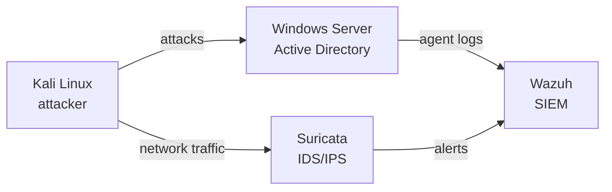

# SOC Home Lab – Detection with Wazuh & Suricata

> A fully virtualized SOC lab to simulate realistic attacks against an Active Directory environment and practice alert triage.

## Architecture

## Stack
- **Wazuh** – SIEM: log collection, detection rules, alerting
- **Suricata** – network IDS/IPS
- **Active Directory** – target environment
- **Kali Linux** – attack simulation

## Setup
<!-- TODO: hypervisor, VM sizing, network layout, Wazuh agent install commands -->

## Attack scenarios
| Scenario | MITRE ATT&CK | Detected by | Result |
| --- | --- | --- | --- |
| <!-- TODO e.g. brute force on RDP --> | <!-- T1110 --> | <!-- Wazuh rule ID --> | <!-- detected / missed --> |

## Results
<!-- TODO: screenshots of Wazuh dashboards and alerts in /screenshots -->

## What I learned
<!-- TODO: 3 bullets, e.g. tuning noisy rules, mapping alerts to ATT&CK -->

## Next steps
- Map every scenario to MITRE ATT&CK
- Add custom Wazuh rules and document false positives

> ⚠️ Isolated lab network only.
