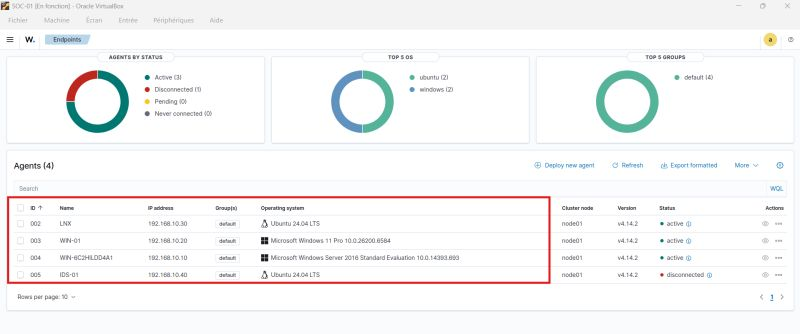
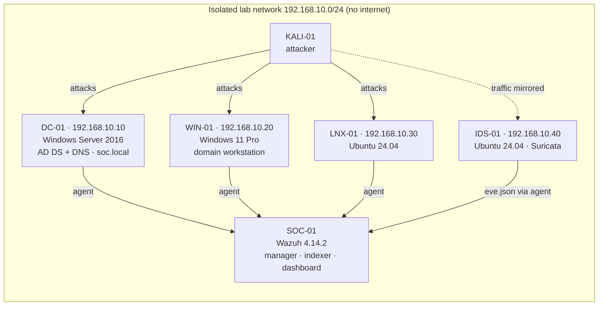
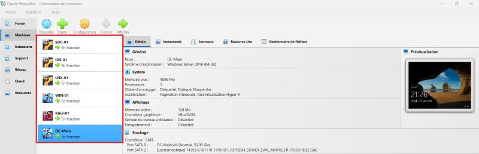
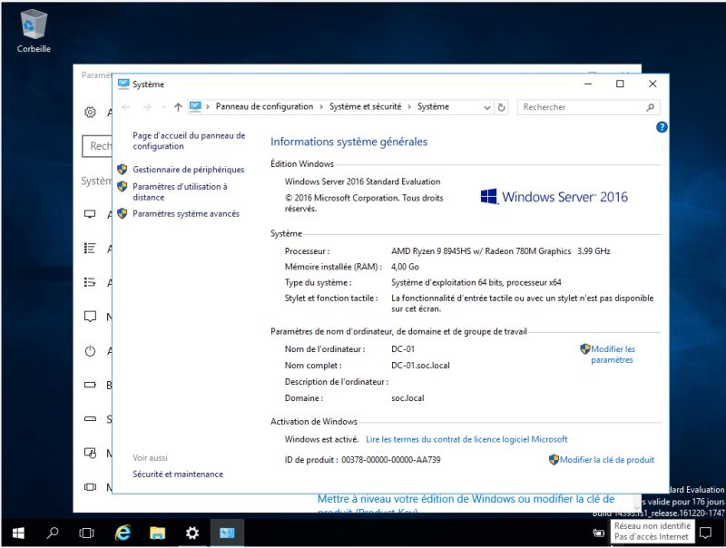

# SOC Home Lab – Detection with Wazuh & Suricata

> A virtualized SOC lab on VirtualBox: an Active Directory domain monitored by Wazuh (SIEM/XDR) and Suricata (network IDS), attacked from Kali Linux, to practice detection engineering and alert triage.
> Built while preparing for the **Cisco CyberOps Associate** certification.

## Architecture

| VM | Role | OS | IP | Wazuh agent |
| --- | --- | --- | --- | --- |
| SOC-01 | Wazuh all-in-one (manager, indexer, dashboard) | Ubuntu | – | – |
| DC-Main / DC-01 | Domain controller `soc.local` (AD DS, DNS) – 3 vCPU, 4 GB RAM, 50 GB | Windows Server 2016 | 192.168.10.10 | 004 |
| WIN-01 | Domain workstation | Windows 11 Pro | 192.168.10.20 | 003 |
| LNX-01 | Linux server (SSH) | Ubuntu 24.04 LTS | 192.168.10.30 | 002 |
| IDS-01 | Suricata network IDS | Ubuntu 24.04 LTS | 192.168.10.40 | 005 |
| KALI-01 | Attacker | Kali Linux | DHCP | – |

Host: laptop with AMD Ryzen 9 8945HS, Oracle VirtualBox.

## Stack
- **Wazuh 4.14.2** – SIEM/XDR: log collection, decoding, detection rules, alerting, dashboards
- **Suricata** – network IDS, alerts shipped to Wazuh through `eve.json`
- **Active Directory** (Windows Server 2016) – target environment
- **Kali Linux** – attack simulation
- **VirtualBox** – virtualization, internal network for isolation

## Repository layout
| Path | Content |
| --- | --- |
| [`docs/setup.md`](docs/setup.md) | Build steps: network, Wazuh install, agent enrollment, Suricata integration, Windows audit policy |
| [`docs/scenarios.md`](docs/scenarios.md) | Attack scenario playbook: commands, expected telemetry, ATT&CK mapping, triage notes |
| [`wazuh/local_rules.xml`](wazuh/local_rules.xml) | Custom Wazuh rules for AD attacks (privileged group changes, Kerberoasting, log clearing) |
| [`wazuh/ossec-agent-ids.conf`](wazuh/ossec-agent-ids.conf) | Agent config snippet on IDS-01 to forward Suricata alerts |
| [`suricata/local.rules`](suricata/local.rules) | Custom Suricata signatures (scans, RDP/SMB bursts) |
| [`screenshots/`](screenshots) | Lab evidence |

## Lab status
- [x] Network and 6 VMs built, isolated from the internet
- [x] AD domain `soc.local` promoted on DC-01
- [x] Wazuh 4.14.2 deployed, 4 agents enrolled (DC-01, WIN-01, LNX-01, IDS-01)
- [ ] Fix IDS-01 agent connectivity (shown *disconnected* in the screenshot below)
- [ ] Deploy custom rules from this repo and validate them with `wazuh-logtest`
- [ ] Run the scenarios in [`docs/scenarios.md`](docs/scenarios.md) and record observed results

## Attack scenarios
Full playbook with commands and triage steps: [`docs/scenarios.md`](docs/scenarios.md).

| # | Scenario | MITRE ATT&CK | Expected detection | Observed |
| --- | --- | --- | --- | --- |
| 1 | Network discovery with Nmap | T1046 | Suricata `sid:1000001` → Wazuh | _to run_ |
| 2 | SSH brute force on LNX-01 | T1110.001 | Wazuh built-in sshd rules (5710 / 5712) | _to run_ |
| 3 | RDP / SMB password spraying on domain accounts | T1110.003 | Windows 4625 → Wazuh 60122 / 60204, Suricata `sid:1000002-3` | _to run_ |
| 4 | Kerberoasting (SPN service account) | T1558.003 | Event 4769 with RC4 → custom rule 100110 | _to run_ |
| 5 | User added to Domain Admins | T1098 | Events 4728 / 4732 / 4756 → custom rule 100100 | _to run_ |
| 6 | Security log cleared | T1070.001 | Event 1102 → custom rule 100120 | _to run_ |

## Screenshots
| | |
| --- | --- |
|  | **VirtualBox** – the six lab VMs running (SOC-01, IDS-01, LNX-01, WIN-01, KALI-01, DC-Main). |
|  | **DC-01** – Windows Server 2016 joined as domain controller of `soc.local`, no internet access. |
|  | **Wazuh 4.14.2** – 4 enrolled agents across Windows and Linux; IDS-01 disconnected at capture time. |

## What I learned
- Sizing a full SOC stack on one laptop: the Wazuh indexer is the most memory-hungry component, so RAM is planned around SOC-01 first.
- Enrolling agents on Windows and Linux; agent names are fixed at enrollment (DC-01 shows as `WIN-6C2HILDD4A1` because it was enrolled before the rename to DC-01).
- Default Windows audit policy is not enough: Kerberos and account-management auditing must be enabled by GPO before Wazuh can see those attacks.

## Next steps
- Add Sysmon on WIN-01 and DC-01 for process-level telemetry
- Map every alert to MITRE ATT&CK in a Wazuh dashboard
- Document false positives and tune noisy rules

> ⚠️ Isolated lab network only. No production data.
